# Описание системы управления проектами TechFlow (В разработке)

## Обзор интерфейсов системы

### 1. Экран авторизации
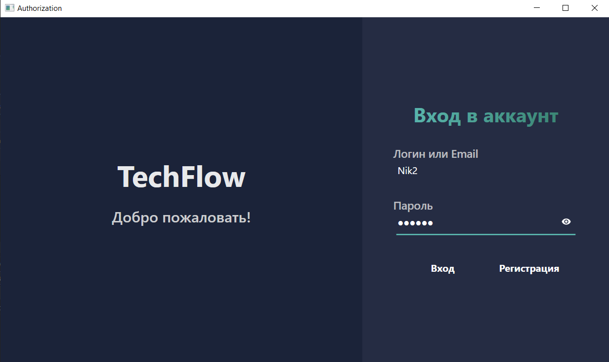
Система начинается с экрана входа, где пользователи могут авторизоваться, указав логин или email и пароль. Интерфейс предоставляет две основные кнопки действий: "Вход" для существующих пользователей и "Регистрация" для новых. Пароль скрывается символами (●●●●●●) для обеспечения безопасности. Дизайн выполнен в минималистичном стиле с четкой иерархией элементов.

### 2. Форма регистрации
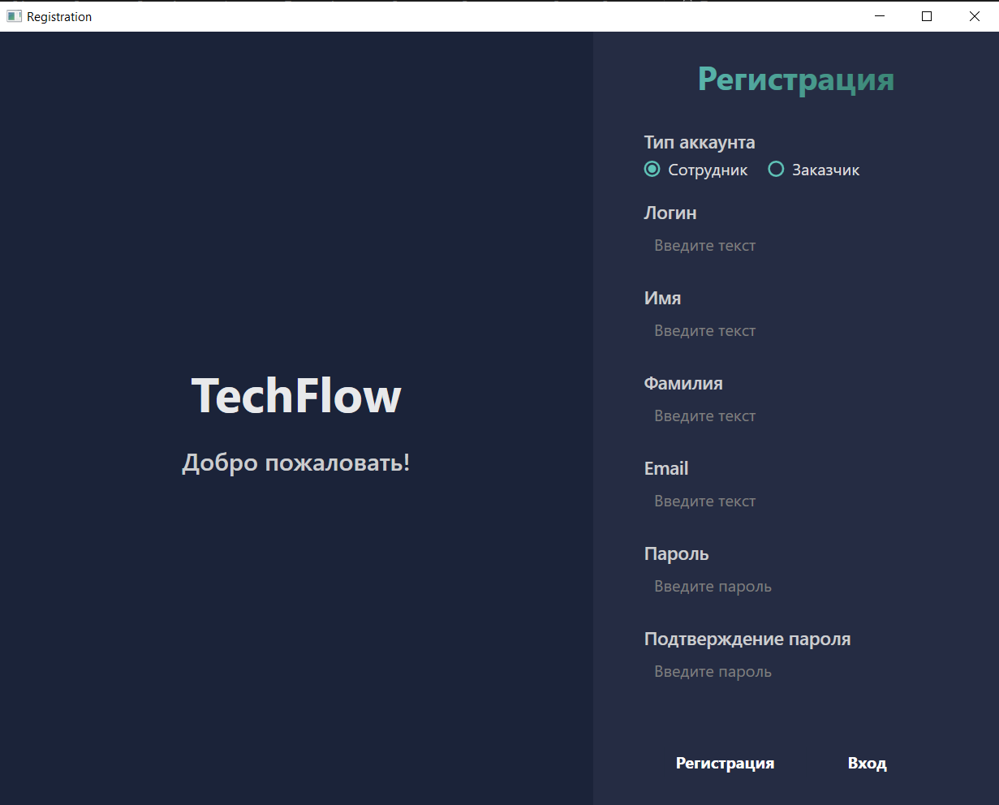

Процесс регистрации включает выбор типа аккаунта (сотрудник или заказчик) с переключателем. Обязательные поля для заполнения: логин, имя, фамилия, email и пароль (с подтверждением). Для заказчиков дополнительно предусмотрено поле "Название организации". Внизу формы расположены кнопки "Регистрация" и альтернативный вариант "Вход" для уже зарегистрированных пользователей.

### 3. Экран ожидания подтверждения
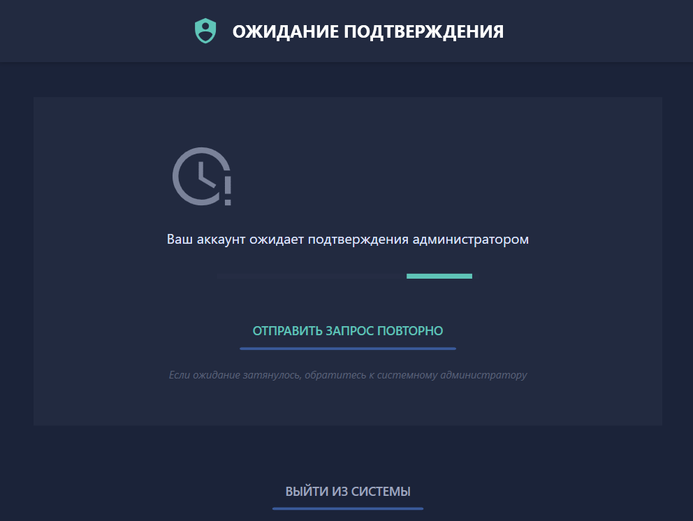
После регистрации новые пользователи видят экран с сообщением о том, что их аккаунт ожидает подтверждения администратором. Здесь доступна возможность отправить запрос повторно или выйти из системы. Сообщение подчеркивает, что при длительном ожидании следует обратиться к системному администратору.

### 4. Личный кабинет сотрудника
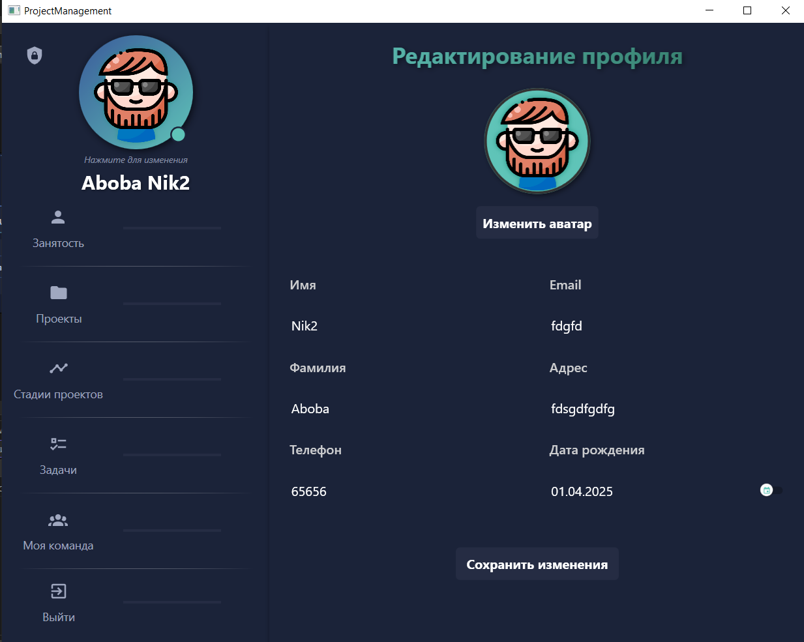
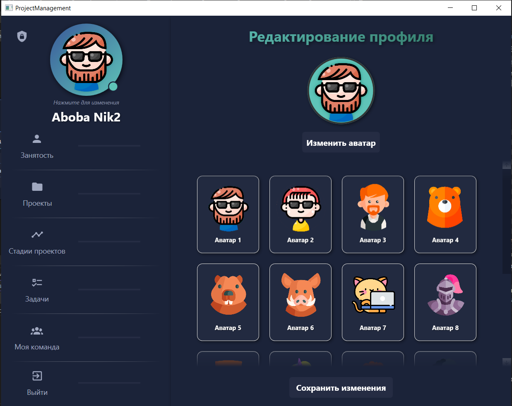
Основной рабочий интерфейс сотрудника содержит несколько ключевых элементов:
- Информация о текущем расписании (в данном случае "Не определен")
- Чекбоксы для управления занятостью (проекты, стадии проектов, задачи)
- Навигационное меню ("Моя команда", "Выйти")
- Календарный вид с отметками о присутствии на рабочем месте

### 5. Панель управления проектами
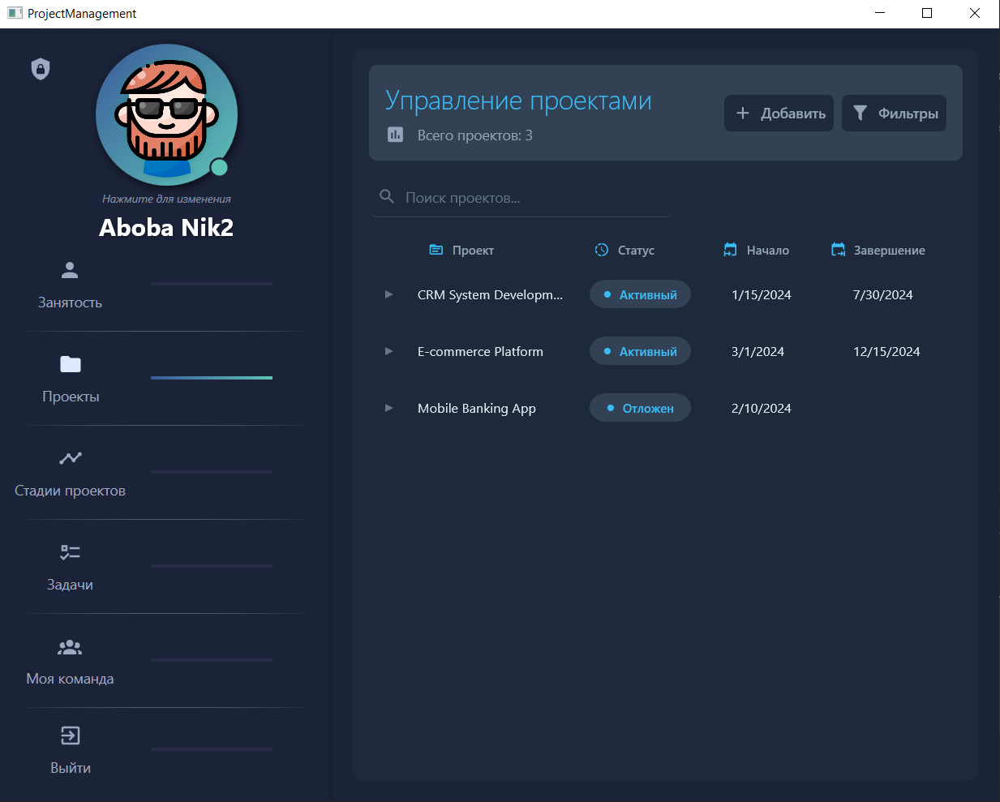
Центральный элемент системы включает:
- Общее количество проектов (3) с возможностью поиска
- Таблицу проектов с колонками: название, статус, даты начала и завершения
- Фильтры для сортировки проектов
- Информацию о текущем пользователе и навигацию по разделам

### 6. Детали проекта
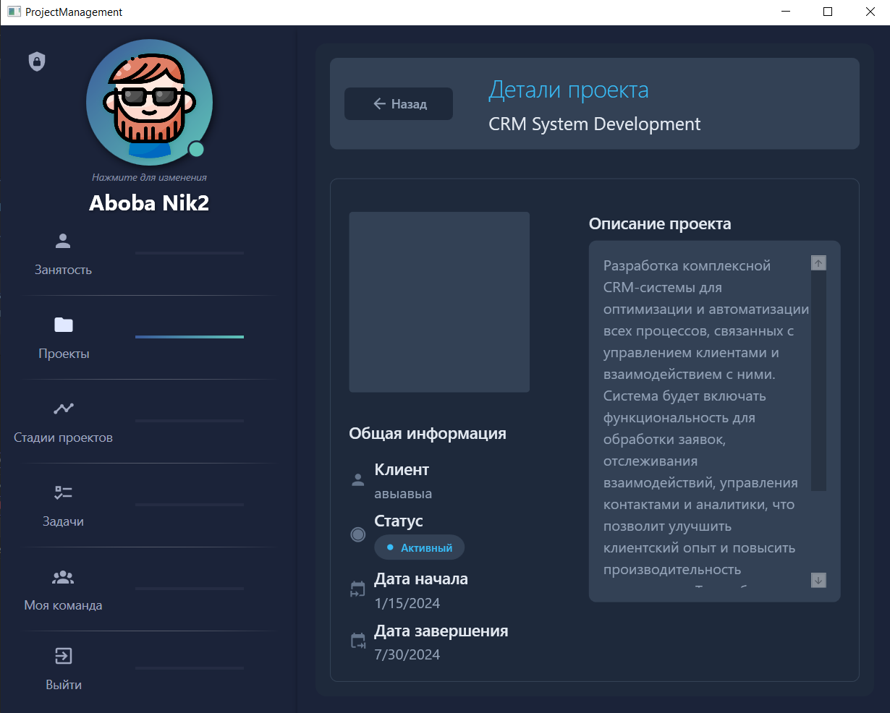
При выборе конкретного проекта (например, "CRM System Development") открывается страница с:
- Полным описанием проекта и его целей
- Навигацией по разделам проекта
- Кнопкой "Назад" для возврата к списку
- Секцией "Занятость" с доступными действиями

### 7. Состав команды
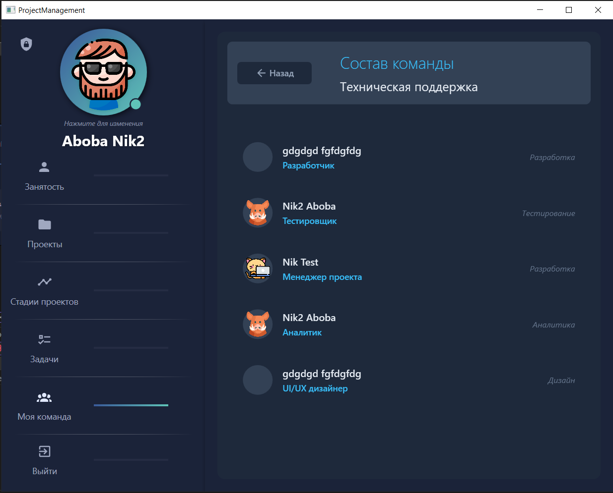
Раздел отображает:
- Название команды ("Техническая поддержка")
- Список участников с указанием их ролей
- Функционал для изменения состава
- Основные направления работы каждого участника

### 8. Техническая поддержка
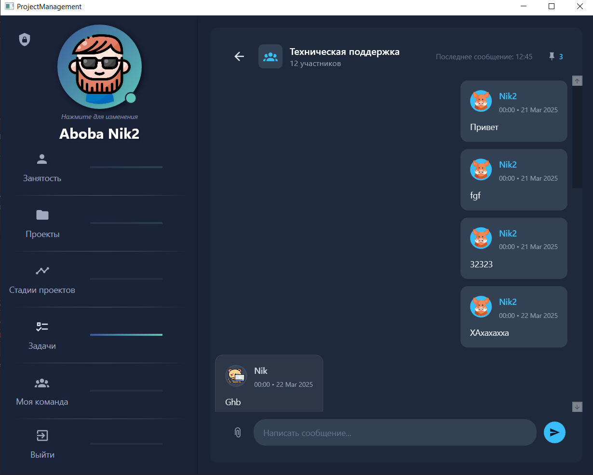
Интерфейс внутренней коммуникации содержит:
- Общее количество участников (12)
- Индикатор последнего сообщения
- Историю переписки с временными метками
- Поле для ввода новых сообщений
- Навигацию по основным разделам системы

### 9. Создание заказа проекта
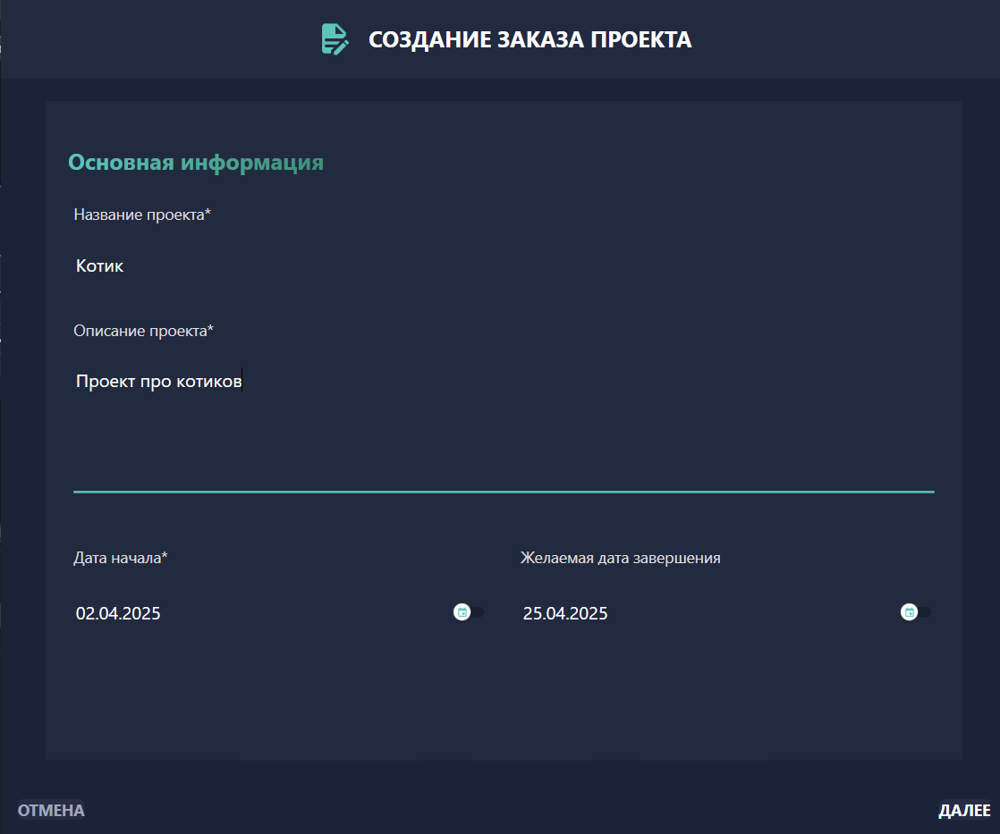
Для заказчиков предусмотрен многоэтапный процесс:
- Основная информация (название, описание)
- Указание дат начала и завершения
- Выбор типа проекта и бюджета
- Дополнительные требования (срочность, конфиденциальность)
- Финальное подтверждение перед отправкой

### 10. Управление задачами
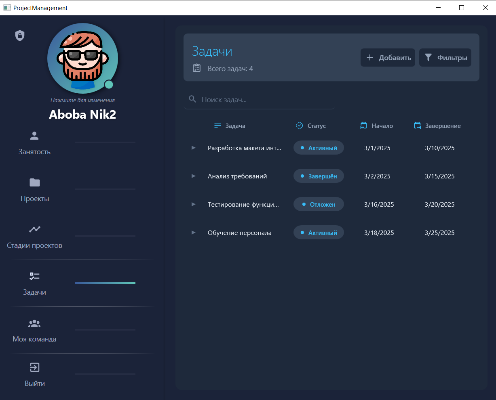
Раздел включает:
- Общее количество задач (4) с возможностью добавления новых
- Табличный вид с фильтрацией
- Колонки: название задачи, статус, сроки выполнения
- Быстрый доступ к персональным настройкам

### 11. Административная панель
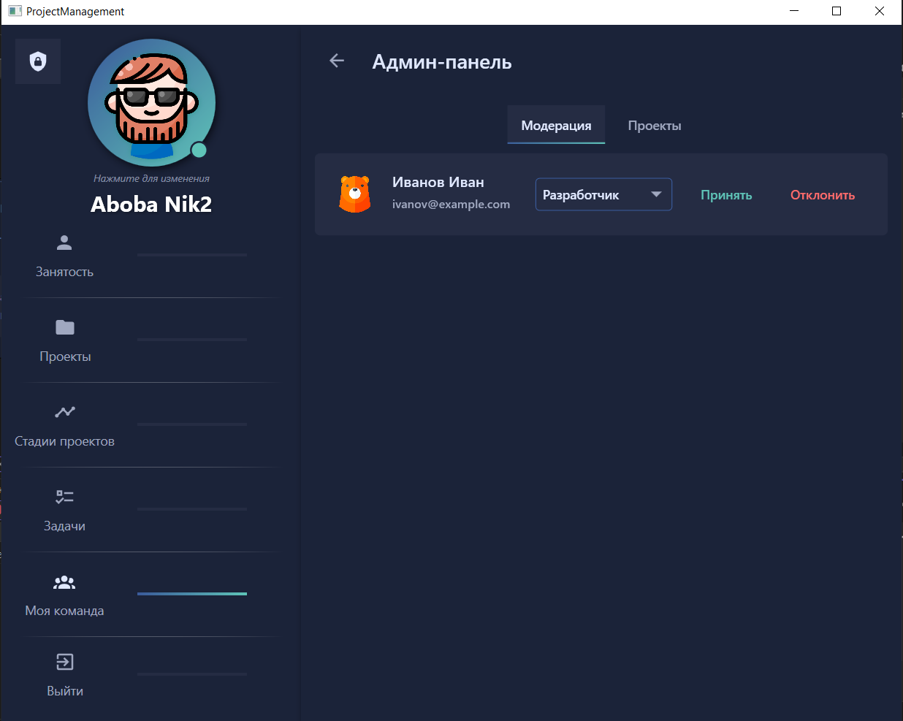
Интерфейс для администраторов содержит:
- Раздел модерации проектов
- Список пользователей, ожидающих подтверждения
- Инструменты для управления правами доступа
- Компактное отображение информации о пользователях
- Кнопки действий ("Принять"/"Отклонить")

Каждый экран системы сохраняет единый стиль оформления с четкой навигацией и интуитивно понятным расположением элементов. Интерфейс адаптирован под разные роли пользователей (сотрудник, заказчик, администратор), предоставляя каждому соответствующий набор функций. Описан далеко не полный функционал. Чтобы посмотреть уже готовую часть, которая будет дорабатываться можно склонировать репозиторий:


# Установка системы управления проектами TechFlow

## 1. Клонирование репозитория

```sh
git clone https://github.com/1Mantih1/TechFlow.git
cd TechFlow
```

## 2. Установка зависимостей

Перед установкой убедитесь, что у вас установлен **.NET 6.0 SDK** или выше.

Скачайте и установите **.NET SDK** с официального сайта:
[Скачать .NET SDK](https://dotnet.microsoft.com/en-us/download/dotnet)

### Для Windows:

Если вы используете Visual Studio, убедитесь, что у вас установлены следующие компоненты:
- .NET Desktop Development
- WPF и Windows Forms
- MSBuild Tools

Дополнительно установите **Microsoft C++ Build Tools**, если у вас возникают ошибки сборки.
[Скачать Build Tools](https://visualstudio.microsoft.com/visual-cpp-build-tools/)

## 3. Настройка конфигурации

Создайте файл **appsettings.json** в корне проекта и добавьте туда необходимые параметры:

```json
{
  "Database": {
    "ConnectionString": "Server=localhost;Database=techflow;User Id=admin;Password=admin123;"
  },
  "Logging": {
    "LogLevel": {
      "Default": "Information"
    }
  }
}
```

## 4. Запуск проекта

### Через Visual Studio:
1. Откройте **TechFlow.sln**
2. Выберите **TechFlow** в качестве стартового проекта
3. Нажмите **F5** для запуска

### Через терминал:

```sh
dotnet build

dotnet run --project TechFlow
```

## 5. (Опционально) Создание исполняемого файла

Для сборки готового исполняемого файла выполните команду:

```sh
dotnet publish -c Release -r win-x64 --self-contained true
```

Готовый файл будет находиться в папке **bin/Release/net6.0-windows/win-x64/publish**.

## 6. (Опционально) Создание службы Windows (для серверного развертывания)

1. Создайте службу Windows:

```sh
sc create TechFlowService binPath="C:\Path\To\TechFlow.exe" start=auto
```

2. Запустите службу:

```sh
sc start TechFlowService
```

3. Остановить службу:

```sh
sc stop TechFlowService
